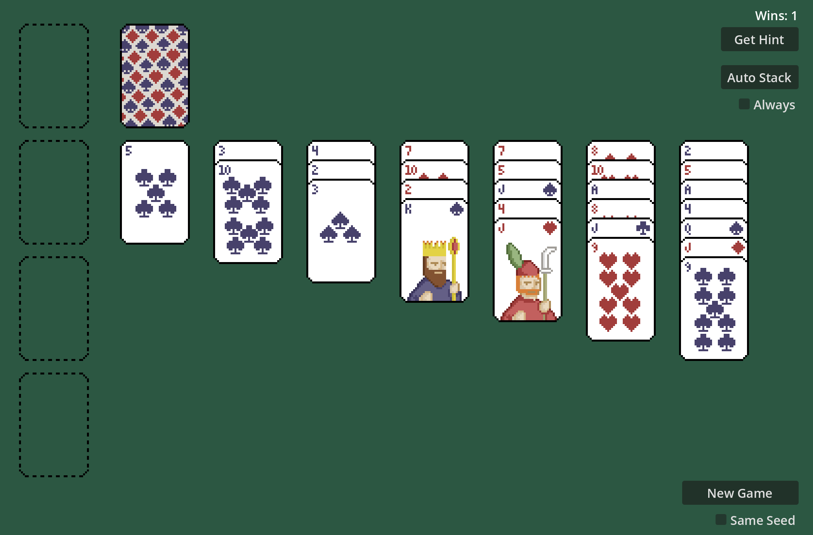

# Solitaire in Godot

Using [Sawayama rules](https://www.watsonbrosgames.com/solitaire/) by [Zachtronics](https://www.zachtronics.com/solitaire-collection/)

Cards: [Pixel Art Cards by Glenn Dittman](https://opengameart.org/content/pixel-art-cards)
Sounds: [54 Casino sound effects (cards, dice, chips) by Kenney](https://opengameart.org/content/54-casino-sound-effects-cards-dice-chips)

A remake of my [solitaire-ebiten](https://github.com/ChrisPritchard/solitaire-ebiten) project, but in Godot. Much easier, and I was able to add more features like the get hint system and auto stacking.

